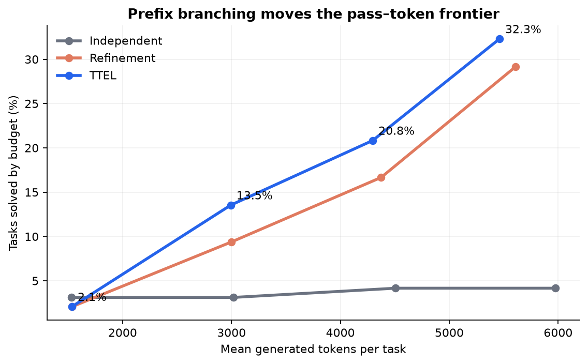
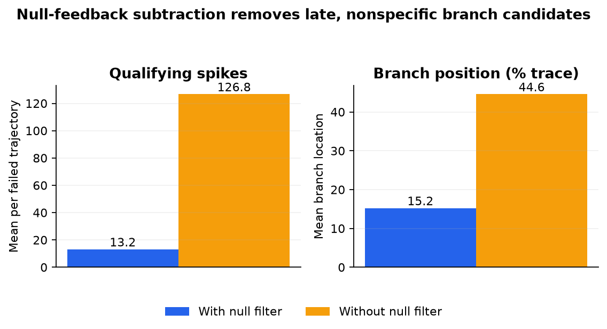
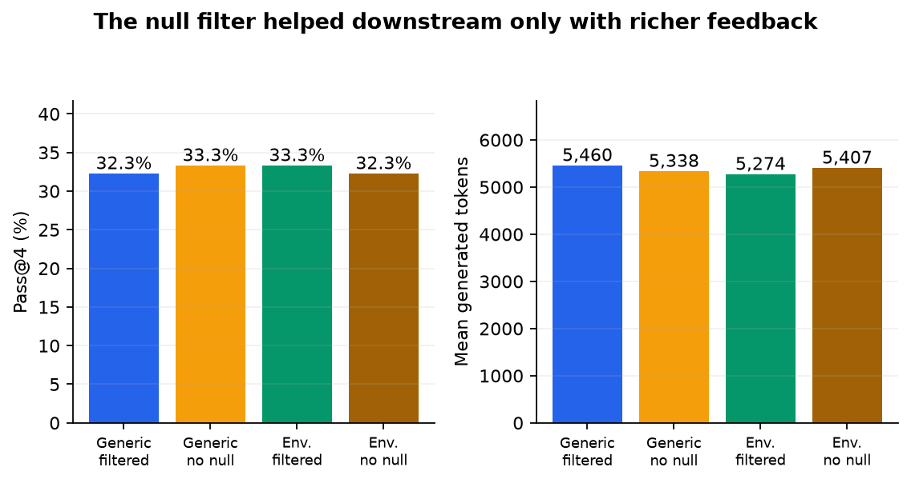
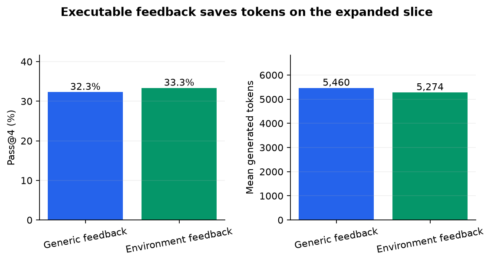
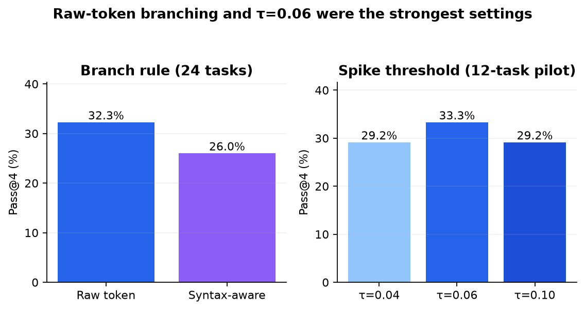

# Reproducing Test-Time Scaling via Error Localization

When a program fails, a language model can either start over or try to identify the first token where the answer went off course. The paper *Test-Time Scaling via Error Localization* argues that feedback can reveal that point, letting the model keep a promising prefix and regenerate only the suffix. We tested whether this idea improves the number of solved coding problems per generated token, and whether a neutral-feedback comparison is what makes the localization specific.

**Verdict: partially reproduced.** On a fresh 24-task executable slice, feedback-conditioned token localization plus prefix branching solved **32.3%** of task-seed pairs by four attempts, versus **4.2%** for independent sampling, while using **8.6% fewer generated tokens**. The null-feedback subtraction removed most candidate spikes and moved branches much earlier; its downstream benefit appeared with executable feedback but not with a generic failure sentence.

**Scope.** This is a downscaled causal test: Qwen3-4B-Thinking-2507, 24 deterministic stdin-only LiveCodeBench V6 tasks (8 easy, 8 medium, 8 hard), four seeds, four attempts, and 1,536 new tokens per attempt. The paper used 131 tasks, up to 64 attempts, 16,384 tokens per attempt, and primarily reported Qwen3-8B. All formal runs used Kubernetes on NVIDIA RTX PRO 6000 Blackwell GPUs, with 16 GPUs at peak.

**How to read this figure.** Each point adds one allowed attempt. Higher and farther left is better: more tasks are solved with fewer generated tokens. By attempt four, filtered TTEL reached 32.3% at 5,460 tokens, refinement reached 29.2% at 5,610, and independent sampling reached 4.2% at 5,976. The paired task-seed sample is small (96 observations, not 96 independent tasks), so the magnitude should not be generalized to the paper’s full benchmark; the direction and efficiency advantage are clear in this slice.

## What was implemented

For every failed trajectory, we teacher-forced the same tokens under three contexts: the original problem, the problem plus real failure feedback, and the problem plus a neutral instruction. A token qualified as an error spike when feedback reduced its probability by more than 0.06 but neutral feedback did not. We branched from the qualifying token with the largest neutral-versus-real feedback separation, retained its prefix, and sampled a new suffix.

This reconstructs the paper’s released filtered-spike criterion. Generic feedback said only that the attempt was unsuccessful; the environment variant exposed the first public-test syntax, runtime, or wrong-answer message. Candidates were executed in isolated subprocesses against public and private LiveCodeBench tests. Independent sampling discarded every prior attempt; whole-trajectory refinement placed the previous code and generic feedback in a fresh prompt.

## Finding 1 — prefix branching improved the frontier

The primary expanded comparison aligns with the headline mechanism: TTEL gained 28.1 percentage points over independent sampling at attempt four and generated 516 fewer tokens per task on average. A paired bootstrap over the 24 tasks, after averaging seeds, gave 95% intervals of +13.5 to +43.8 points and −842 to −233 tokens. TTEL also exceeded whole-trajectory refinement (32.3% versus 29.2%) while using 2.7% fewer tokens; its pass-rate interval crossed zero (−5.2 to +12.5 points), while the token interval did not (−327 to −8). [The self-contained notebook](../../notebooks/ttel_reproduction.py) exposes all curve values and bounded sensitivities.

| Method | Slice | Pass@4 | Mean tokens | Assessment |
|---|---:|---:|---:|---|
| Independent | 24 tasks × 4 seeds | 4.2% | 5,976 | matched baseline |
| Whole refinement | 24 tasks × 4 seeds | 29.2% | 5,610 | matched baseline |
| Filtered TTEL | 24 tasks × 4 seeds | **32.3%** | **5,460** | aligned |

## Finding 2 — the null baseline localized; its downstream effect depended on feedback

Removing the null comparison increased qualifying spikes from 13.2 to 126.8 per failed trajectory—a 9.6× rise—and shifted the mean branch from 15.2% to 44.6% of the trajectory. This strongly supports the claim that neutral-feedback subtraction suppresses nonspecific probability changes. LiveCodeBench has no ground-truth error token, so spike inflation is the false-location proxy rather than a direct localization-accuracy label.

With generic feedback, the causal chain stopped there: no-null pass@4 was 1.0 point higher and token use 2.2% lower. With executable feedback, however, the filter improved pass@4 from 32.3% to 33.3% and reduced tokens from 5,407 to 5,274. The localization claim reproduces strongly; the downstream claim is **partially aligned and feedback-dependent** in this slice.

## Finding 3 — feedback and branch choices mattered modestly

Environment feedback raised pass@4 from 32.3% to 33.3% and reduced tokens by 3.4%. A paired task bootstrap gave a wide pass interval (−5.2 to +7.3 points) but a token interval below zero (−394 to −34). This aligns with the richer-feedback claim on efficiency, while the success improvement remains uncertain.

## Finding 4 — the reconstruction was reasonably robust

On the expanded slice, snapping the raw branch token backward to a nearby syntax boundary reduced pass@4 from 32.3% to 26.0% and did not improve prefix validity (100.0% versus 99.1%); raw-token branching was therefore retained. In the 12-task threshold pilot, 0.04 and 0.10 both reached 29.2%, below the reconstructed 0.06 setting at 33.3%, while using similar tokens.

## Claim-by-claim assessment

| Claim | Paper result | Observed result | Assessment |
|---|---|---|---|
| TTEL improves pass/token frontier | At 64 attempts: 71.0% TTEL vs 64.6% independent and 56.7% refinement; 360k vs 735k tokens for TTEL/independent | At 4 attempts: 32.3% TTEL vs 4.2% independent and 29.2% refinement; 5,460 vs 5,976 and 5,610 tokens | Aligned, downscaled |
| Null subtraction removes false locations | 19.3 vs 486 spikes without null | 13.2 vs 126.8 spikes; branches at 15.2% vs 44.6% | Aligned |
| Removing null degrades downstream outcome | pass@16 fell to 59.2% | Generic: no degradation. Environment: −1.0 point and +2.5% tokens without null | Partially aligned; feedback-dependent |
| Rich feedback improves localization/outcome | 65.8% environment vs 63.0% generic at 16 attempts | 33.3% vs 32.3%, with 3.4% fewer tokens | Directionally aligned; pass uncertain |

## Limits and reproducibility

This does not estimate the paper’s LiveCodeBench pass@64 or cross-model generality. The subset excludes call-based tasks, counts four stochastic seeds per task, and truncates long reasoning sharply. Public-test messages can also be less informative than full judge feedback. A full reproduction needs all 131 tasks, the 8B model, 64 attempts, the paper’s long token cap, and confidence intervals over additional seeds.

The implementation, exact embedded measurements, figure generator, and tutorial notebook are on `main`. The key lineages are the [independent baseline](https://github.com/alphaXiv/test-time-scaling-via-error-localization/tree/orx/expanded-24-task-independent), [refinement baseline](https://github.com/alphaXiv/test-time-scaling-via-error-localization/tree/orx/expanded-24-task-refinement), [filtered TTEL](https://github.com/alphaXiv/test-time-scaling-via-error-localization/tree/orx/expanded-24-task-filtered-ttel), [no-null ablation](https://github.com/alphaXiv/test-time-scaling-via-error-localization/tree/orx/expanded-24-task-no-null-ttel), and [environment-feedback variant](https://github.com/alphaXiv/test-time-scaling-via-error-localization/tree/orx/expanded-24-task-environment-ttel). Formal model elapsed time ranged from 18.9 to 43.3 minutes per four-GPU run; the full fresh research window was **2.51 hours**. Kubernetes was the only compute backend, using NVIDIA RTX PRO 6000 Blackwell GPUs with 16 GPUs concurrently.

